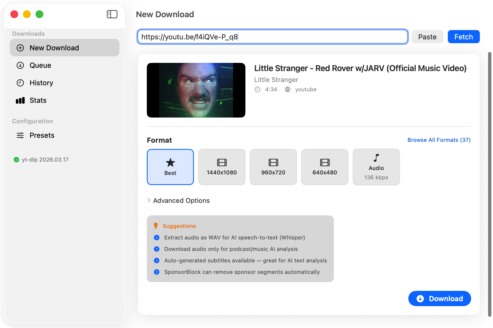
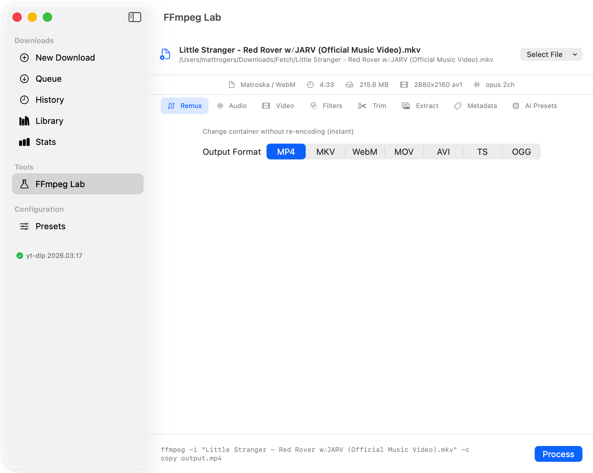
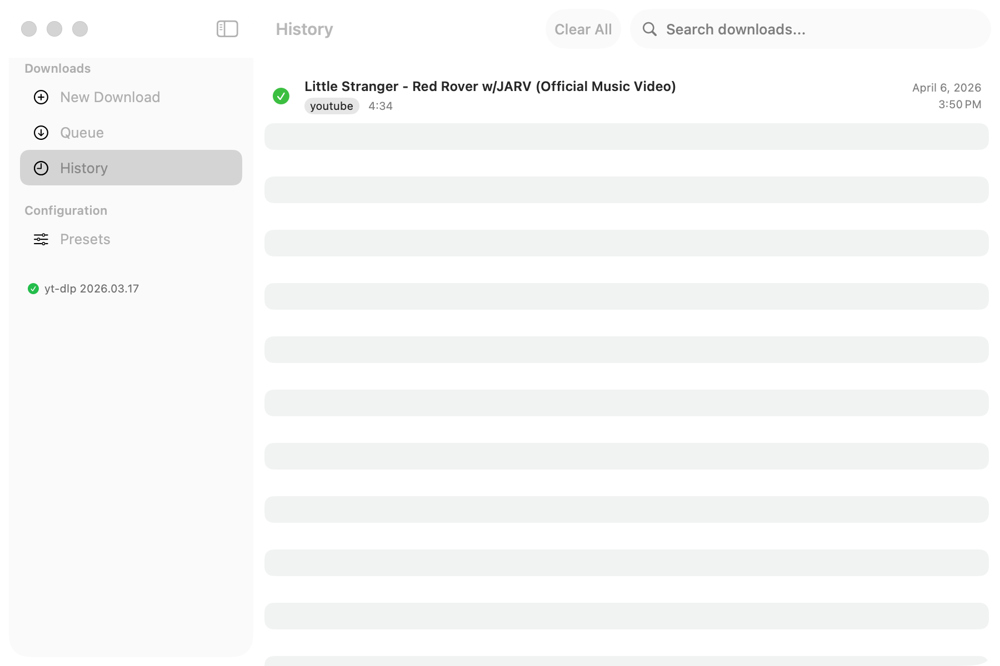
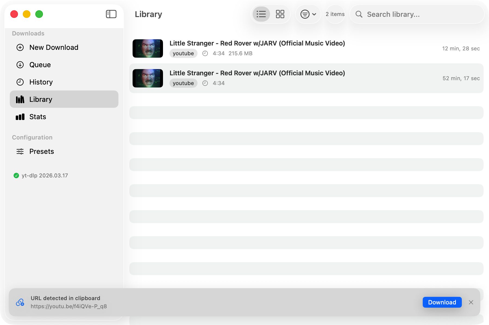
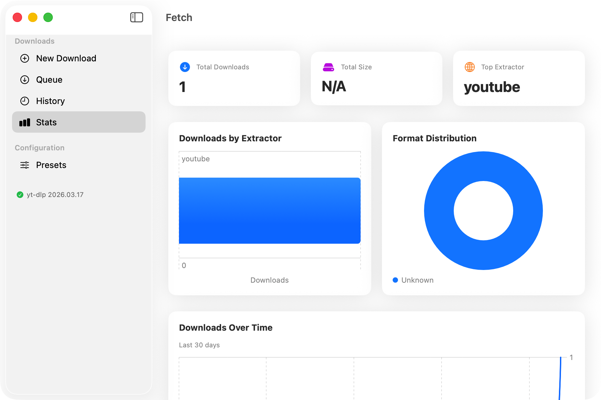
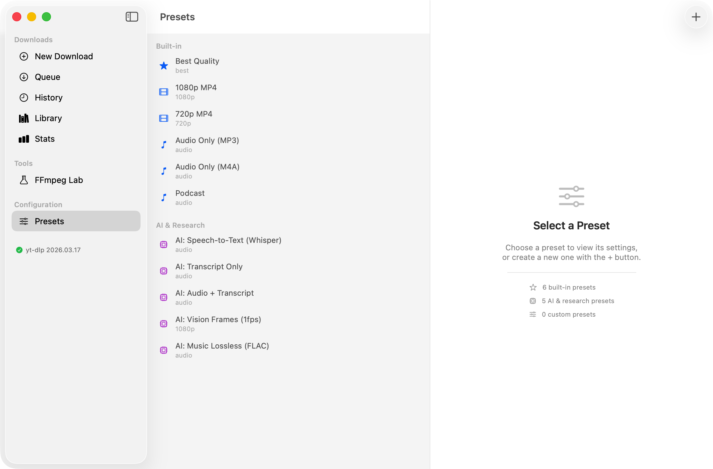

# Fetch

[](https://www.gnu.org/licenses/agpl-3.0)
[](https://developer.apple.com/macos/)
[](https://swift.org)

[](https://github.com/twitchyvr/Fetch/releases/latest)

**[Download DMG](https://github.com/twitchyvr/Fetch/releases/latest/download/Fetch-v0.2.0-macOS.dmg)** | **[Website](https://twitchyvr.github.io/Fetch/)** | **[Wiki](https://github.com/twitchyvr/Fetch/wiki)** | **[Changelog](CHANGELOG.md)**

A native macOS frontend for [yt-dlp](https://github.com/yt-dlp/yt-dlp), built with SwiftUI.

Fetch wraps yt-dlp with a polished native interface — paste a URL, pick a format, download. It dynamically discovers yt-dlp's capabilities at runtime, so when yt-dlp updates with new features or site support, Fetch adapts without needing a rebuild.

## Screenshots

| Media Info + Transcripts | FFmpeg Lab | History |
|:---:|:---:|:---:|
|  |  |  |

| Library | Stats | Presets (11 built-in) |
|:---:|:---:|:---:|
|  |  |  |

## Features

- **Native macOS app** — SwiftUI, Apple HIG compliant, premium gradient UI
- **FFmpeg Lab** — 8 operation panels: Remux, Audio, Video, Filters, Trim, Extract, Metadata, AI Presets. Process any file, not just downloads
- **Playlist support** — auto-detect playlists, 5 download modes (Best/Audio/Video/Transcript/Audio+Transcript), audio format picker, organized in subfolders
- **Transcript support** — 158+ subtitle languages, SRT/VTT/ASS formats, embed or separate file, auto-generated captions
- **AI export presets** — one-click: Whisper-ready WAV, Transcript Only, Vision AI frames, Music Lossless FLAC
- **Stats dashboard** — Swift Charts: downloads by extractor, format distribution, activity timeline
- **Media Library** — catalog with sort/filter/search, list+grid views, file-exists tracking
- **Scheduled downloads** — queue for later with date/time countdown
- **Batch downloads** — paste multiple URLs, drop text/JSON files, smart URL extraction
- **Advanced options** — subtitles, SponsorBlock, cookies, proxy, auth, post-processing, chapter splitting
- **AI suggestions** — contextual tips for Whisper, podcast AI, auto-subs, SponsorBlock
- **Interactive onboarding** — 4-step walkthrough with Skip option, rotating tips
- **Dynamic format discovery** — queries yt-dlp per-URL for available formats, resolutions, and codecs
- **Download queue** — concurrent downloads with gradient progress bars, thumbnail previews, cancel/retry
- **macOS notifications** — banner notifications on download completion with "Open" and "Show in Finder" actions
- **Dock badge** — shows active download count
- **Clipboard monitoring** — detects media URLs copied to clipboard and offers one-click download
- **Drag-and-drop** — drop URLs or text files from any browser directly into the app
- **Download presets** — 6 built-in + 5 AI presets + custom presets
- **Download history** — SwiftData-backed with search, thumbnails, relative dates, file tracking
- **Full accessibility** — VoiceOver labels, WCAG AA contrast, keyboard navigation
- **1800+ supported sites** — anything yt-dlp supports, Fetch supports

## Requirements

- macOS 15.0 (Sequoia) or later
- [yt-dlp](https://github.com/yt-dlp/yt-dlp) installed via Homebrew: `brew install yt-dlp`
- [ffmpeg](https://ffmpeg.org/) recommended for format merging: `brew install ffmpeg`

## Building

Fetch uses [XcodeGen](https://github.com/yonaskolb/XcodeGen) — `project.yml` is the source of truth.

```bash
# Install XcodeGen if needed
brew install xcodegen

# Generate Xcode project and build
xcodegen generate
xcodebuild -project Fetch.xcodeproj -scheme Fetch -destination 'platform=macOS' build

# Run tests
xcodebuild -project Fetch.xcodeproj -scheme FetchTests -destination 'platform=macOS' test

# Build to a known location for testing
xcodebuild -project Fetch.xcodeproj -scheme Fetch -configuration Debug SYMROOT="$(pwd)/build" build
open ./build/Debug/Fetch.app
```

Or open `Fetch.xcodeproj` in Xcode 16+ and build (Cmd+B).

## Architecture

```text
Fetch/
├── FetchApp.swift                  @main entry — WindowGroup, MenuBarExtra, Settings
├── Models/
│   ├── Download.swift              SwiftData @Model — persisted download history
│   ├── Preset.swift                SwiftData @Model — saved download presets
│   └── FormatOption.swift          Value types: FormatOption, MediaInfo, PlaylistInfo
├── Services/
│   ├── YTDLPService.swift          Actor — all yt-dlp process execution
│   ├── FfmpegService.swift         Actor — ffprobe analysis + ffmpeg processing
│   ├── DownloadManager.swift       @Observable @MainActor — download queue
│   ├── ClipboardMonitor.swift      @Observable @MainActor — pasteboard URL detection
│   ├── NotificationService.swift   UNUserNotificationCenter + Dock badge
│   ├── SpotlightService.swift      CoreSpotlight indexing of downloads
│   ├── URLParser.swift             Multi-format URL extraction + validation
│   ├── TextAnalysisService.swift   NaturalLanguage — keywords, sentiment, insights
│   └── AppIntentsProvider.swift    Siri Shortcuts integration
└── Views/
    ├── ContentView.swift           Root NavigationSplitView + clipboard banner
    ├── SidebarView.swift           Sidebar navigation + yt-dlp version footer
    ├── NewDownloadView.swift       URL input → fetch info → format picker → download
    ├── DownloadQueueView.swift     Active downloads + context menus
    ├── DownloadRowView.swift       Single download row with shimmer progress
    ├── FormatPickerView.swift      Full format table (sheet) with filters
    ├── PlaylistPickerView.swift    Playlist entry picker with 5 download modes
    ├── TranscriptOptionsView.swift Subtitle language/format picker
    ├── AdvancedOptionsView.swift   Post-processing, network, auth, output options
    ├── HistoryView.swift           SwiftData query of past downloads
    ├── LibraryView.swift           Catalog with sort/filter/search, list+grid views
    ├── StatsView.swift             Swift Charts — extractor, format, timeline
    ├── FfmpegLabView.swift         8-panel post-processing lab
    ├── PresetEditorView.swift      Preset list + detail editor (HSplitView)
    ├── SettingsView.swift          App settings (General, Downloads, Advanced)
    ├── OnboardingView.swift        4-step interactive walkthrough
    ├── DesignSystem.swift          Apple design tokens — colors, spacing, elevation
    ├── AuroraView.swift            Animated gradients + shimmer + pulsing glow
    └── TipBanner.swift             Rotating contextual tips for empty states
```

### Key Design Decisions

- **Actor isolation**: `YTDLPService` is an actor. All `Process` I/O runs off the main thread via `terminationHandler` and `readabilityHandler` — no blocking the cooperative thread pool.
- **Zero external dependencies**: No SPM packages. Everything is built with system frameworks.
- **Runtime discovery**: Never hardcodes formats, sites, or CLI flags. yt-dlp's `--dump-json`, `--help`, and `--list-extractors` are the source of truth.
- **SwiftData for persistence**: Download history and presets are stored via SwiftData with explicit `context.save()` for crash safety.

## Contributing

See [CONTRIBUTING.md](CONTRIBUTING.md) for guidelines. All contributions are under AGPL-3.0.

## License

Copyright (C) 2026 Matt Rogers

This program is free software: you can redistribute it and/or modify it under the terms of the **GNU Affero General Public License v3.0** as published by the Free Software Foundation.

This is the most restrictive widely-recognized open source license. Key implications:

- **Copyleft**: Any derivative work must also be AGPL-3.0 licensed
- **Source disclosure**: You must provide source code for any modifications
- **Network use = distribution**: If you run a modified version as a network service, you must release the source
- **Attribution required**: Derivative works must credit "Based on Fetch by Matt Rogers"

See [LICENSE](LICENSE) for full terms.
